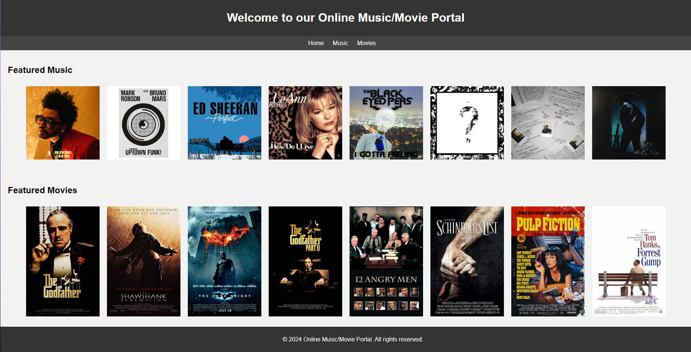
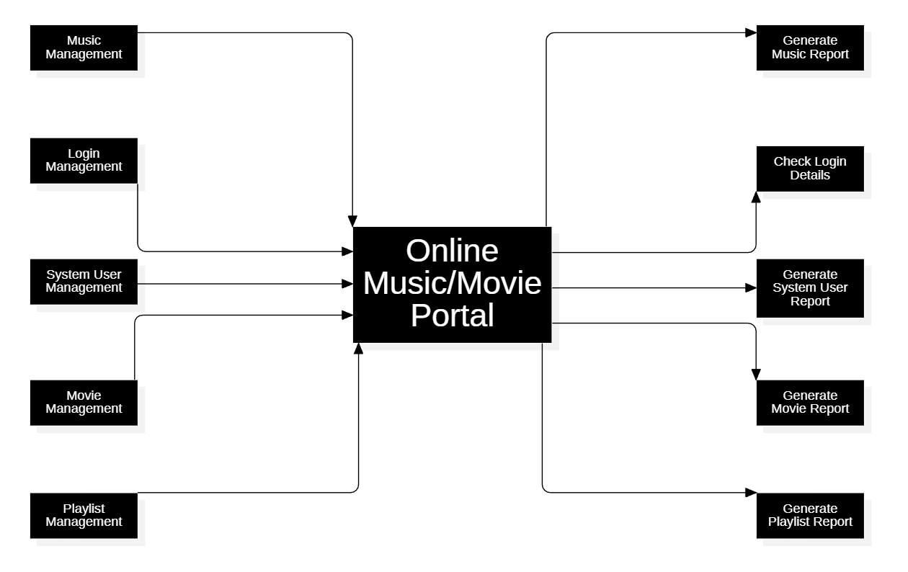
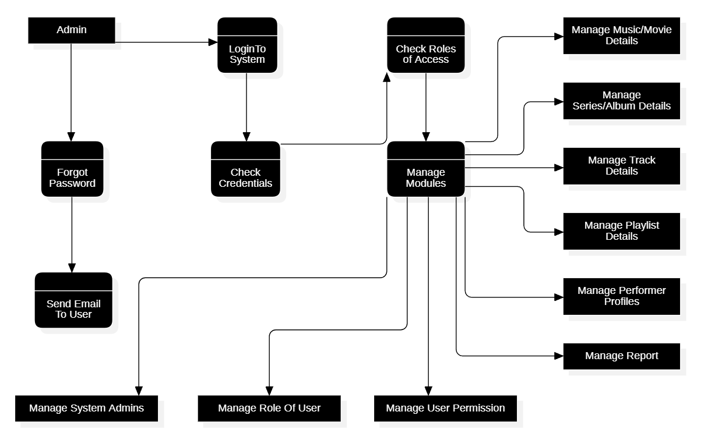
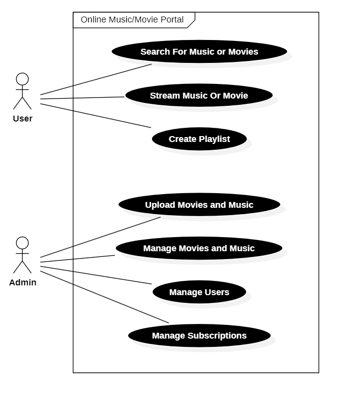
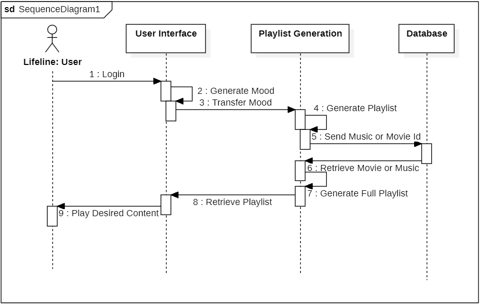
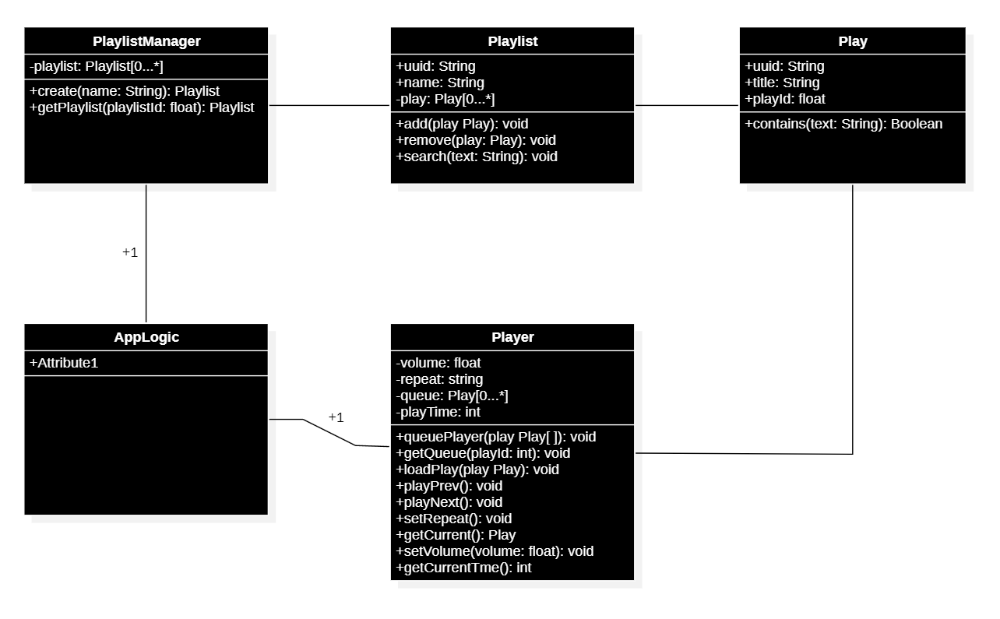
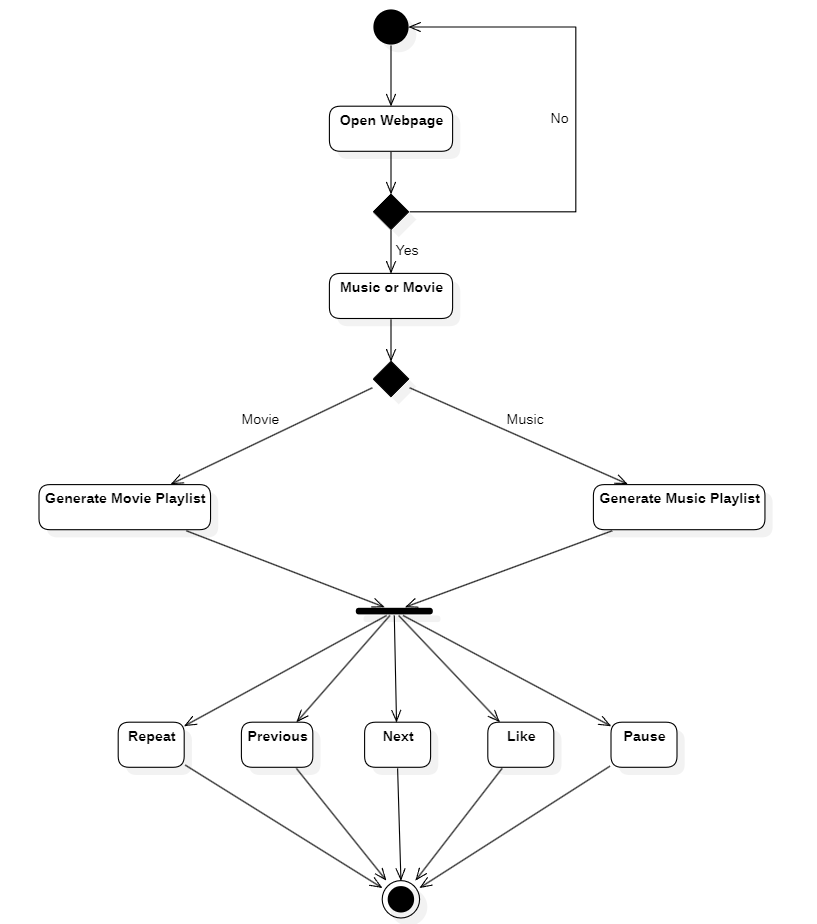

# Online Music/Movie Portal

Welcome to our Online Music/Movie Portal! This portal provides users with access to a curated collection of music and movies.

## Description

This project consists of a simple web application built using HTML, CSS, and JavaScript. It offers a user-friendly interface for browsing featured music and movies.

## Features

- Navigation menu for easy access to different sections (Home, Music, Movies).
- Featured Music section displaying images of selected music.
- Featured Movies section displaying images of selected movies.
- Responsive design for optimal viewing on various devices.

## Information Flow

### Dataflow Diagram

### Use Case Diagram

### Sequence Diagram

### Class Diagram

### Activity Diagram

## Usage

To use the Online Music/Movie Portal, simply open the `index.html` file in a web browser. From there, you can navigate through the different sections using the provided links in the navigation menu.

## Installation

1. Clone or download the repository to your local machine.
2. Navigate to the directory where you saved the files.
3. Open the `index.html` file in a web browser.

## File Structure

- `index.html`: Main HTML file containing the structure and content of the portal.
- `styles.css`: CSS file containing styles for the portal layout and design.
- `script.js`: JavaScript file containing functionality for interactivity (e.g., hover effects).

## Credits

This project was created by **Soumyojit Sen Gupta, Subhajit Santra, Muskan Parwin, Anushka Jana** as a demonstration of basic web development skills.

